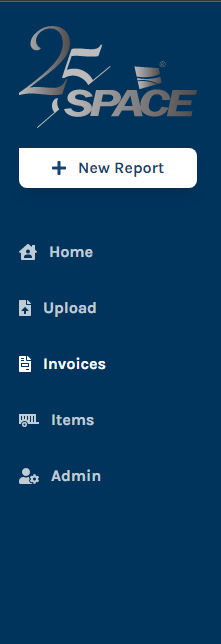

## Manual de instruciones

### Pagina Web

La pagina web de spacebot srive para matener el control de las facturas que suban los clientes y administradores es la unica parte que tendra interacion con el cliente final 

#### 

### Funcionalidades

La página web de spacebot sirve para mantener el control de las facturas que
suban los clientes y administradores es la única parte que tendrá interacción
con el cliente final.

#### Menu (Admin)

- Home 
  
  - Acceso a la vista principal

- Upload 
  
  - Acceso a la vista para subir archivos

- Invoices
  
  - Acceso a la vista para administrar la facturas

- Items
  
  - Acceso a la vista para administrar items

- Admin 
  
  - Acesso a la vista para administrador

#### Menu (Client)

- Home
  
  - Acceso a la vista principal

- Upload
  
  - Acceso a la vista para subir archivos

### Vistas (client y admin)

#### Home

La vista home ofrese una lista detallada de los procesos que tiene en cola el bot, consiste en una tabla con los campos id ,authon, path y status, todos estos procesos son los que el usuario a subido para que el bot los procese. En esta vista podemos ver una lista de los procesos que tiene en cola el bot, los cuales se muestran en una tabla, con los campos id, authon, path y status. Esto nos permite saber si el bot está procesando algún trabajo, quien lo subió, la ruta del archivo y el estado en el que se encuentra. Además, esta vista incluye una serie de botones para realizar acciones sobre los procesos. Estos botones permiten a los usuarios detener, reanudar o eliminar los procesos en cola. Esto le permite a los usuarios controlar el procesamiento de los archivos y el uso de la memoria y CPU del bot.

#### Upload(Client,Admin)

La vista upload es una parte importante de los sistemas de procesamiento de facturas. Esto permite a los usuarios subir sus facturas de manera rápida y sencilla. Esta interfaz de arrastrar y soltar reduce significativamente el tiempo necesario para subir los archivos, lo que ahorra tiempo y esfuerzo. La vista upload también ofrece una forma segura de enviar archivos, ya que los archivos son encriptados para evitar el acceso no autorizado. Esto garantiza que los datos de los usuarios estén seguros. Además, la vista upload también ofrece una opción de comprobación de errores para asegurarse de que los archivos se carguen correctamente. Esto evita los errores de archivo y garantiza que los archivos se procesen correctamente.

#### Invoices(Admin)

La vista invoice ofrese una lista detallada de las facturas procesadas por el bot, consiste en una tabla con los campos id ,date, origin , total, rfc, todos estos campos se puedes hacer operaciones crud para porder ver los detalles de cada factura. También permite la búsqueda de facturas por número de factura, nombre del cliente, RFC, etc. Además, el usuario puede filtrar las facturas por estado, fecha de vencimiento, monto total, etc. para encontrar la información específica que necesita. La vista invoice también incluye una sección de informes para ver un resumen de todas las facturas procesadas en un determinado periodo de tiempo, así como un gráfico para una fácil visualización.

#### Items(Admin)

La vista items ofrese una detallada de las items procesadas por el bot, consiste en una tabla con los campos NUM_INVOICES ,DATE_INVOICES,ORIGIN_INVOICES TOTAL_INVOICES,RFC_CLIENTS todos estos campos se puedes hacer operaciones crud para porder ver los detalles de cada items La vista items también permite filtrar los items procesados por el bot de acuerdo a los parámetros especificados. Los parámetros de filtrado disponibles son: fecha de factura, origen de factura, RFC del cliente y total de factura. Estos parámetros permiten que el usuario visualice la información específica que desee ver.

#### Admin (Admin)

La admin ofrece en dashboard de administracion de usuarios que le permiten administrar todos los usuarios de su sitio web.El dashboard de administración de usuarios también le permite ver informes sobre el uso de su sitio web, permitiéndole ver quién está visitando su sitio web, desde dónde y con qué dispositivos.

Asignas permisos y editar los usuarios activos del la web.

